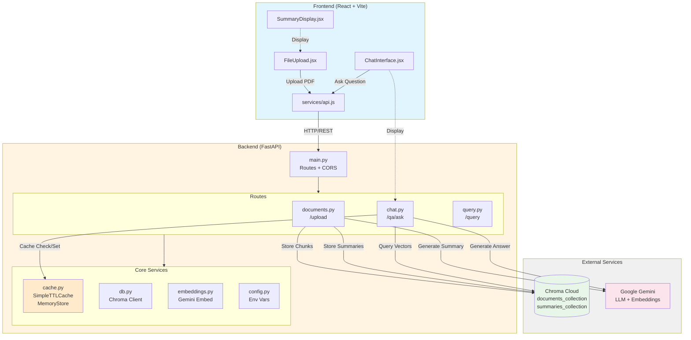
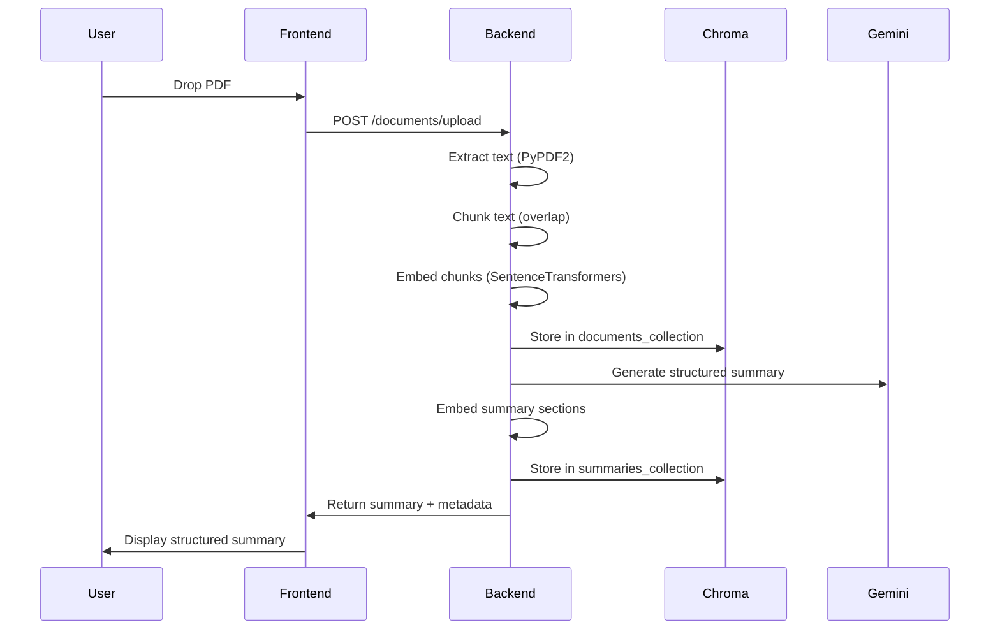
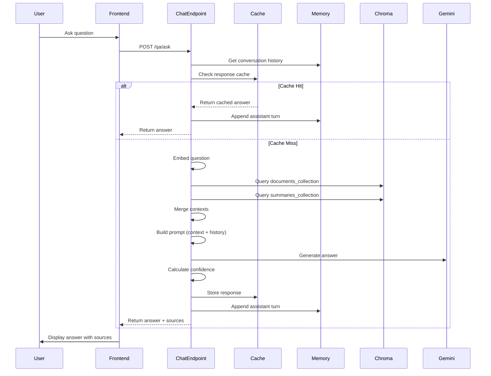
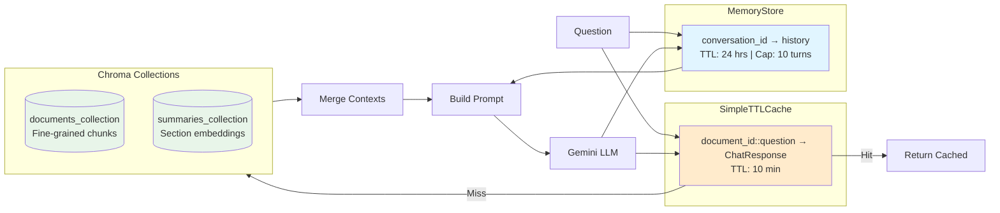

# Research Assistant for PDFs

Full-stack RAG app to upload a research PDF, auto-summarize it, and chat with an LLM that continuously familiarizes itself through summary-aware vectors, caching, and per-conversation memory.

## System Architecture



## Data Flow Diagrams

### Upload Flow


### Chat Flow (with Cache & Memory)


### Cache & Memory Architecture


## What it does
- **PDF upload and parsing**: Single-PDF intake, text extraction, chunking with overlap.
- **Structured summaries**: Gemini generates concise sections (Title/Authors, Abstract, Problem, Methodology, Key Results, Conclusion) returned to the UI.
- **Dual vector stores**:
	- `documents_collection`: fine-grained chunks for detailed grounding.
	- `summaries_collection`: section-level summary embeddings to make the chatbot feel more familiar and faster on re-asks.
- **Self-improving chat loop**:
	- Per-conversation memory keeps recent turns to maintain context.
	- Response cache avoids repeating identical LLM calls for the same doc/question.
	- Combined retrieval (chunks + summaries) gives both breadth and focus.
- **Sources and confidence**: Answers include retrieved context snippets and a simple confidence estimate derived from vector distances.

## Backend
- **FastAPI** entrypoint: `backend/main.py` (routes + CORS wiring).
- **Documents pipeline**: `routes/documents.py`
	1) Extract text (PyPDF2) and chunk with overlap.
	2) Embed chunks (SentenceTransformers all-mpnet-base-v2) → `documents_collection` in Chroma Cloud.
	3) Generate structured summary (Gemini) and embed each section → `summaries_collection`.
	4) Return metadata + summary to the frontend.
- **Chat / RAG**: `routes/chat.py`
	- Endpoint: `/qa/ask` takes `document_id`, `question`, optional `conversation_id`, `top_k`.
	- Retrieves relevant chunks **and** summary vectors, merges context, builds a prompt with conversation memory, and calls Gemini for the answer.
	- Response cache and conversation memory (see `cache.py`) reduce latency and cost.
- **Caching & memory**: `cache.py`
	- `SimpleTTLCache`: memoizes answers per document/question for a short TTL.
	- `MemoryStore`: keeps the last N exchanges per conversation with a TTL to preserve context.
- **Embeddings**: `embeddings.py` (Gemini embeddings helper for legacy/simple queries).
- **Config**: `config.py` loads env vars (Chroma keys, collections, cache/memory settings).
- **Models**: `models/chat_models.py` defines request/response contracts.

## Frontend (React + Vite)
- `FileUpload.jsx`: drag/drop upload with size/type validation and progress states.
- `SummaryDisplay.jsx`: renders the structured summary returned by the backend.
- `ChatInterface.jsx`: conversation-scoped chat; shows sources and confidence; supplies `conversationId` to maintain memory.
- `services/api.js`: central API client (`uploadDocument`, `askQuestion`, `checkHealth` if desired by the app).

## Environment
Copy `.env.example` to `.env` and set at least:
- `GEMINI_API_KEY`
- `CHROMA_API_KEY`, `CHROMA_TENENT`, `CHROMA_DATABSE`
- `CHROMA_COLLECTION` (default `documents_collection`)
- `SUMMARIES_COLLECTION` (default `summaries_collection`)
- `CACHE_TTL_SECONDS`, `MEMORY_TTL_SECONDS`, `MEMORY_MAX_MESSAGES`

## Run locally
Backend
```bash
cd backend
pip install -r requirements.txt
uvicorn main:app --reload
```

Frontend
```bash
cd frontend
npm install
npm run dev
```

## Usage flow
1) Start backend and frontend.
2) Upload a PDF → get structured summary and metadata.
3) Ask questions → RAG uses chunks + summary vectors; answers include sources and confidence; repeated identical questions hit the response cache; conversation memory keeps context per `conversationId`.

## Notes
- Re-upload a document to refresh both chunk and summary embeddings.
- The chatbot “self-improves” per session by combining cached answers, short-term memory, and summary-aware retrieval, making follow-up questions feel more tailored without retraining the model.
