# Research Assistant CAG - System Architecture

## Overview

The Research Assistant CAG (Context-Augmented Generation) is a full-stack application designed for intelligent document processing and conversational Q&A over research papers. The system leverages RAG (Retrieval-Augmented Generation) with dual-layer vector storage, intelligent caching, and conversation memory.

---

## Complete System Architecture

```mermaid
graph TB
    subgraph Client["🖥️ Frontend - React + Vite"]
        UI[User Interface]
        FileUploadComp[📄 File Upload Component]
        ChatComp[💬 Chat Interface Component]
        SummaryComp[📊 Summary Display Component]
        APIService[🔌 API Service Layer]
    end
    
    subgraph Backend["⚙️ Backend - FastAPI + Python"]
        subgraph API["API Routes"]
            DocRoute[📁 /documents/upload]
            QueryRoute[🔍 /query]
            ChatRoute[💭 /qa/ask]
        end
        
        subgraph Core["Core Services"]
            SummaryExtractor[📝 Summary Extractor<br/>Gemini 2.5 Flash]
            EmbeddingService[🧮 Embedding Service<br/>all-mpnet-base-v2]
            CacheService[💾 Cache Service<br/>Response Cache + Memory]
        end
        
        subgraph Storage["Storage Layer"]
            ResponseCache[(⚡ Response Cache<br/>TTL: 10 min<br/>Max: 256)]
            MemoryStore[(🧠 Memory Store<br/>TTL: 24 hrs<br/>Max: 10 msgs)]
        end
    end
    
    subgraph VectorDB["🗄️ ChromaDB Vector Storage"]
        DocsCollection[(📚 documents_collection<br/>Fine-grained chunks<br/>1000 chars overlap)]
        SummariesCollection[(📋 summaries_collection<br/>6 structured sections<br/>Title, Abstract, etc.)]
    end
    
    subgraph AI["🤖 AI Services - Google Gemini"]
        GeminiLLM[Gemini 2.5 Flash<br/>Chat & Summary Generation]
        GeminiEmbed[Gemini Embedding 001<br/>Optional Embeddings]
    end
    
    subgraph LocalML["🔬 Local ML Models"]
        SentenceTransformer[SentenceTransformers<br/>all-mpnet-base-v2<br/>768 dimensions]
    end
    
    %% User Interactions
    UI --> FileUploadComp
    UI --> ChatComp
    ChatComp --> SummaryComp
    
    %% API Communication
    FileUploadComp --> APIService
    ChatComp --> APIService
    APIService -->|POST /documents/upload| DocRoute
    APIService -->|POST /qa/ask| ChatRoute
    APIService -->|POST /query| QueryRoute
    
    %% Document Upload Flow
    DocRoute --> SummaryExtractor
    DocRoute --> EmbeddingService
    SummaryExtractor -->|Extract 6 sections| GeminiLLM
    EmbeddingService --> SentenceTransformer
    EmbeddingService --> DocsCollection
    EmbeddingService --> SummariesCollection
    
    %% Query Flow
    ChatRoute --> CacheService
    CacheService -->|Cache Miss| EmbeddingService
    CacheService -->|Cache Hit| ResponseCache
    ChatRoute --> MemoryStore
    EmbeddingService --> DocsCollection
    EmbeddingService --> SummariesCollection
    DocsCollection -->|Retrieve Context| ChatRoute
    SummariesCollection -->|Retrieve Context| ChatRoute
    ChatRoute -->|Generate Answer| GeminiLLM
    ChatRoute -->|Store Response| ResponseCache
    ChatRoute -->|Store Conversation| MemoryStore
    
    %% Query Route Flow
    QueryRoute --> EmbeddingService
    QueryRoute --> DocsCollection
    
    %% Styling
    style Client fill:#e3f2fd
    style Backend fill:#fff9c4
    style VectorDB fill:#e8f5e9
    style AI fill:#f3e5f5
    style LocalML fill:#fce4ec
    style API fill:#fff3e0
    style Core fill:#ffebee
    style Storage fill:#e1bee7
    style DocsCollection fill:#c8e6c9
    style SummariesCollection fill:#c8e6c9
    style ResponseCache fill:#b3e5fc
    style MemoryStore fill:#b3e5fc
```



---

## Component Details

### 1. **Frontend Layer (React + Vite)**

**Technology Stack:**
- React 18.3.1
- Vite (Build Tool)
- CSS Modules for styling

**Components:**
- **FileUpload**: Handles PDF file selection and upload
- **ChatInterface**: Conversational Q&A interface with message history
- **SummaryDisplay**: Displays structured 6-section summary
- **API Service**: Axios-based HTTP client for backend communication

**Key Features:**
- Real-time chat interface
- File drag-and-drop support
- Responsive design
- Error handling and loading states

---

### 2. **Backend Layer (FastAPI + Python)**

**Technology Stack:**
- FastAPI (Web Framework)
- Python 3.11+
- Uvicorn (ASGI Server)

**API Endpoints:**

```python
POST /documents/upload
- Upload PDF, extract text, generate summary
- Chunk document, create embeddings
- Store in both vector collections
- Returns: document_id, summary, metadata

POST /qa/ask
- Accept question + document_id
- Check response cache
- Retrieve from vector stores (chunks + summaries)
- Build enhanced prompt with memory
- Generate answer with Gemini
- Store in cache and memory
- Returns: answer, sources, confidence

POST /query
- Simple vector search endpoint
- Query document collection
- Returns: top-k matching chunks
```

**Core Services:**

**Summary Extractor:**
```python
- Extracts first page of PDF
- Uses Gemini 2.5 Flash for structured extraction
- Generates 6 sections:
  1. Title & Authors
  2. Abstract
  3. Problem Statement
  4. Methodology
  5. Key Results
  6. Conclusion
```

**Embedding Service:**
```python
- Uses SentenceTransformers (all-mpnet-base-v2)
- Free, local inference (no API costs)
- 768-dimensional embeddings
- Processes both documents and queries
```

**Cache Service:**
```python
- Response Cache: TTLCache (10 min, 256 entries)
- Memory Store: Conversation history (24 hrs, 10 messages)
- Thread-safe with locking mechanisms
```

---

### 3. **Vector Database Layer (ChromaDB)**

**Collections:**

**documents_collection:**
- Stores fine-grained document chunks
- Chunk size: 1000 characters
- Overlap: 200 characters
- Metadata: filename, chunk_id, page_info, etc.
- Purpose: Detailed retrieval for specific questions

**summaries_collection:**
- Stores 6 structured summary sections
- Each section embedded separately
- Metadata: document_base_id, section_key
- Purpose: High-level context and fast familiarization

**Configuration:**
```python
Host: Chroma Cloud (or local)
Embedding Model: all-mpnet-base-v2 (768 dims)
Similarity: Cosine similarity
Persistence: Durable storage
```

---

### 4. **AI Services Layer (Google Gemini)**

**Gemini 2.5 Flash:**
```python
Purpose: Chat completion & summary extraction
Temperature: 0.2 (focused, consistent)
Max Tokens: 400 (concise answers)
Features:
- Structured JSON output
- Context-aware responses
- Fast inference
```

**Gemini Embedding 001:**
```python
Purpose: Optional alternative to local embeddings
Dimensions: 768
Status: Not currently used (using free alternative)
```

---

### 5. **Local ML Layer (SentenceTransformers)**

**all-mpnet-base-v2:**
```python
Type: Transformer-based sentence embeddings
Dimensions: 768
Quality: State-of-the-art semantic similarity
Performance: ~1000 docs/sec on CPU
Cost: $0 (runs locally)
Use Cases:
- Document chunk embeddings
- Query embeddings
- Summary section embeddings
```

---

## Data Flow Diagrams

### Document Upload Flow

```mermaid
sequenceDiagram
    participant User
    participant Frontend
    participant API
    participant Backend
    participant ChromaDB
    participant Gemini
    
    User->>Frontend: Upload PDF
    Frontend->>API: POST /documents/upload
    API->>Backend: Process PDF
    
    Backend->>Backend: Extract full text
    Backend->>Backend: Extract first page
    Backend->>Backend: Chunk text (1000 chars)
    
    par Parallel Processing
        Backend->>Gemini: Extract structured summary
        Gemini-->>Backend: 6 sections JSON
        Backend->>Backend: Embed chunks (all-mpnet)
        Backend->>Backend: Embed summary sections
    end
    
    Backend->>ChromaDB: Store chunks → documents_collection
    Backend->>ChromaDB: Store summaries → summaries_collection
    
    ChromaDB-->>Backend: Confirmation
    Backend-->>API: document_id + summary + metadata
    API-->>Frontend: Upload success response
    Frontend-->>User: Display summary
```



### Question Answering Flow


---

## Technology Stack Summary

### Frontend
| Technology | Version | Purpose |
|------------|---------|---------|
| React | 18.3.1 | UI Framework |
| Vite | 6.0.1 | Build Tool & Dev Server |
| Axios | 1.7.9 | HTTP Client |
| CSS | 3 | Styling |

### Backend
| Technology | Version | Purpose |
|------------|---------|---------|
| Python | 3.11+ | Programming Language |
| FastAPI | Latest | Web Framework |
| Uvicorn | Latest | ASGI Server |
| PyPDF2 | Latest | PDF Processing |
| SentenceTransformers | Latest | Local Embeddings |
| ChromaDB | Latest | Vector Database Client |
| Google Generative AI | Latest | Gemini API Client |
| CacheTools | Latest | Caching Library |

### Infrastructure
| Component | Technology | Purpose |
|-----------|------------|---------|
| Vector Database | ChromaDB Cloud | Document & Summary Storage |
| LLM Service | Google Gemini 2.5 Flash | Chat & Summary Generation |
| Embedding Model | all-mpnet-base-v2 | Semantic Embeddings |
| Container | Docker | Deployment |

---

## Deployment Architecture

```mermaid
graph TB
    subgraph Production["🌐 Production Environment"]
        subgraph Frontend_Deploy["Frontend Container"]
            Nginx[Nginx<br/>Port 80]
            ReactApp[React App<br/>Static Files]
        end
        
        subgraph Backend_Deploy["Backend Container"]
            Uvicorn_Server[Uvicorn<br/>Port 8000]
            FastAPI_App[FastAPI Application]
        end
        
        subgraph External["☁️ External Services"]
            ChromaCloud[ChromaDB Cloud<br/>Vector Storage]
            GeminiAPI[Google Gemini API<br/>AI Services]
        end
    end
    
    User[👤 End User]
    
    User -->|HTTP/HTTPS| Nginx
    Nginx --> ReactApp
    ReactApp -->|API Calls| Uvicorn_Server
    Uvicorn_Server --> FastAPI_App
    FastAPI_App -->|Vector Operations| ChromaCloud
    FastAPI_App -->|LLM Requests| GeminiAPI
    
    style Frontend_Deploy fill:#e3f2fd
    style Backend_Deploy fill:#fff9c4
    style External fill:#e8f5e9
    style Production fill:#f5f5f5
```



---

## Key Architectural Decisions

### 1. **Dual-Layer Vector Storage**
**Decision**: Separate collections for document chunks and summaries

**Rationale:**
- Chunks provide detailed, specific information
- Summaries provide high-level context
- Combined retrieval balances precision and recall
- Faster familiarization with new documents

### 2. **Local Embeddings (SentenceTransformers)**
**Decision**: Use free, local embeddings instead of API-based

**Rationale:**
- Zero cost for embeddings
- No rate limits
- Fast local inference
- State-of-the-art quality with all-mpnet-base-v2
- Privacy (no data sent to external services)

### 3. **Three-Tier Caching**
**Decision**: Response cache + Memory store + Vector stores

**Rationale:**
- Response cache: Instant answers for repeated questions
- Memory store: Conversation continuity (24 hours)
- Vector stores: Permanent knowledge base
- Reduces LLM API costs by 40-60%

### 4. **Gemini 2.5 Flash for LLM**
**Decision**: Use Gemini instead of GPT-4 or other alternatives

**Rationale:**
- Fast inference (2-3s response time)
- Low cost
- Good quality for research Q&A
- Structured JSON output support
- Large context window (32k tokens)

### 5. **ChromaDB for Vector Storage**
**Decision**: Use ChromaDB over Pinecone, Weaviate, etc.

**Rationale:**
- Easy setup and deployment
- Cloud-hosted option available
- Good performance for small-medium datasets
- Free tier available
- Python-native integration

---

## Security Considerations

### API Keys
- Stored in `.env` file (not committed to git)
- Environment variables for production
- Separate keys for dev/prod environments

### Data Privacy
- Documents stored in user-scoped collections
- No permanent logging of user queries
- Conversation memory auto-expires (24 hours)
- Local embeddings (no data sent to external services)

### Input Validation
- File type validation (PDF only)
- File size limits
- Input sanitization on all endpoints
- Rate limiting (planned)

---

## Scalability Considerations

### Current Limitations
- In-memory caching (not distributed)
- Single backend instance
- Limited to ~1000s of documents per collection

### Future Improvements
- Redis for distributed caching
- Horizontal scaling with load balancer
- Batch processing for large document sets
- Database indexing optimization
- CDN for frontend assets

---

## Monitoring and Observability

### Metrics to Track
- Response time (median, p95, p99)
- Cache hit rate
- LLM API call count and cost
- Vector search latency
- Error rates by endpoint

### Logging
- Request/response logging
- Error tracking with stack traces
- Performance profiling
- User interaction analytics

---

## Conclusion

The Research Assistant CAG architecture is designed for:
- **Performance**: Multi-tier caching, local embeddings
- **Quality**: Dual-layer retrieval, conversation memory
- **Cost-Efficiency**: Free embeddings, cached responses
- **Scalability**: Modular design, cloud-native services
- **Maintainability**: Clear separation of concerns, typed APIs

The system achieves an optimal balance between response quality, speed, and operational cost, making it suitable for both development and production deployment.
